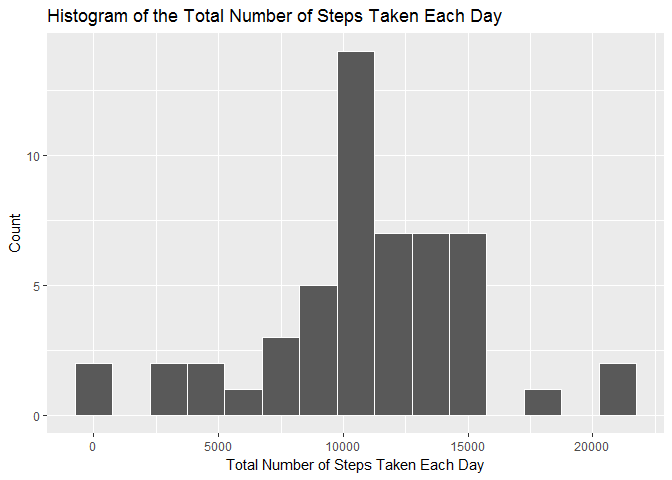
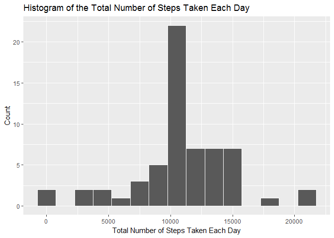
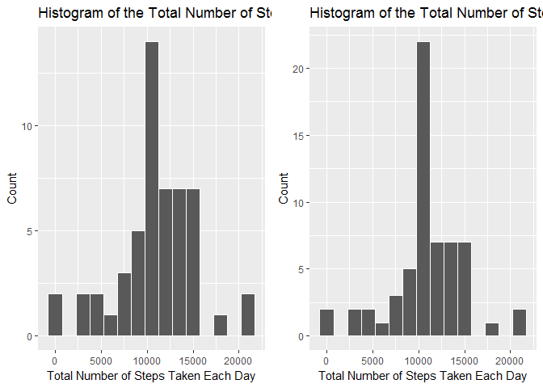
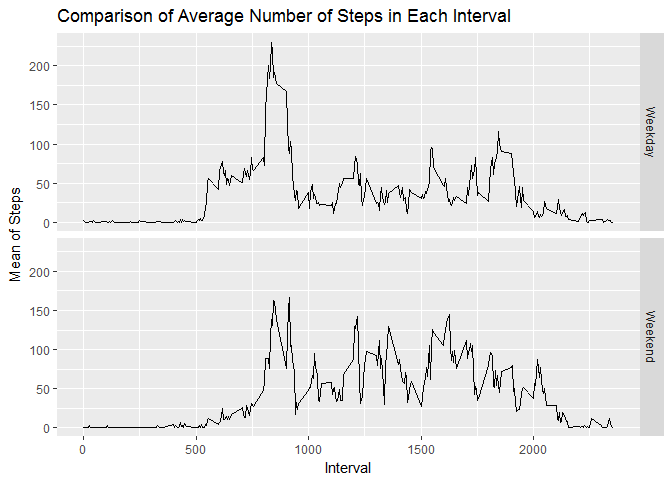

# PA1_template
Seher  
October 12, 2017  


# Course 5 Week 2 Assignment

This assignment answers the questions detailed below. The aim is to complete the entire assignment in a single R markdown document that can be processed by knitr and be transformed into an HTML file.

## Loading and preprocessing the data

Before processing the data, we do some housekeeping like set the working directory, unzipping the data.


```r
setwd("C:/Users/s.fazlioglu/Dropbox/Coursera/Course5_reproducible_research")

# getting necessary packages
library(RCurl)
```

```
## Loading required package: bitops
```

```r
library(dplyr)
```

```
## 
## Attaching package: 'dplyr'
```

```
## The following objects are masked from 'package:stats':
## 
##     filter, lag
```

```
## The following objects are masked from 'package:base':
## 
##     intersect, setdiff, setequal, union
```

```r
library(lubridate)
```

```
## 
## Attaching package: 'lubridate'
```

```
## The following object is masked from 'package:base':
## 
##     date
```

```r
library(data.table)
```

```
## 
## Attaching package: 'data.table'
```

```
## The following objects are masked from 'package:lubridate':
## 
##     hour, isoweek, mday, minute, month, quarter, second, wday,
##     week, yday, year
```

```
## The following objects are masked from 'package:dplyr':
## 
##     between, first, last
```

```r
library(ggplot2)

# download the file an place it into the folder
if(!file.exists("data")){dir.create("data")}
fileUrl <- "https://d396qusza40orc.cloudfront.net/repdata%2Fdata%2Factivity.zip"
download.file(fileUrl,destfile="./data/Dataset.zip",method="libcurl")

# unzip the file
unzip(zipfile="./data/Dataset.zip", exdir="./data")

# get the list of files
list.files("./data", recursive=TRUE)
```

```
## [1] "activity.csv" "Dataset.zip"
```

```r
# the data
activity<- read.csv("./data/activity.csv")
# check what the data looks like
str(activity)
```

```
## 'data.frame':	17568 obs. of  3 variables:
##  $ steps   : int  NA NA NA NA NA NA NA NA NA NA ...
##  $ date    : Factor w/ 61 levels "2012-10-01","2012-10-02",..: 1 1 1 1 1 1 1 1 1 1 ...
##  $ interval: int  0 5 10 15 20 25 30 35 40 45 ...
```

```r
summary(activity)
```

```
##      steps                date          interval     
##  Min.   :  0.00   2012-10-01:  288   Min.   :   0.0  
##  1st Qu.:  0.00   2012-10-02:  288   1st Qu.: 588.8  
##  Median :  0.00   2012-10-03:  288   Median :1177.5  
##  Mean   : 37.38   2012-10-04:  288   Mean   :1177.5  
##  3rd Qu.: 12.00   2012-10-05:  288   3rd Qu.:1766.2  
##  Max.   :806.00   2012-10-06:  288   Max.   :2355.0  
##  NA's   :2304     (Other)   :15840
```

```r
# removing the files 
file.remove("./data/Dataset.zip")
```

```
## [1] TRUE
```

## What is mean total number of steps taken per day?

Calculating the number of steps taken per day


```r
TotalByDay <- summarise(group_by(activity,date), steps=sum(steps))
```

Make a histogram of the total number of steps taken each day


```r
hist1 <- ggplot(data = TotalByDay, aes(steps)) + 
    geom_histogram(binwidth = 1500, colour = "white") +
    xlab("Total Number of Steps Taken Each Day") +
    ylab("Count") +
    ggtitle("Histogram of the Total Number of Steps Taken Each Day")
print(hist1)
```

```
## Warning: Removed 8 rows containing non-finite values (stat_bin).
```

<!-- -->

Calculate and report the mean and median of the total number of steps taken per day
 

```r
mean(na.omit(TotalByDay$steps))
```

```
## [1] 10766.19
```

```r
median(na.omit(TotalByDay$steps))
```

```
## [1] 10765
```

## What is the average daily activity pattern?

Make a time series plot (i.e. type = "l") of the 5-minute interval (x-axis) and the average number of steps taken, averaged across all days (y-axis)

```r
act_int <- aggregate(steps ~ interval, data = activity, FUN =mean)

ggplot(act_int, aes(interval, steps)) + geom_line()
```

<!-- -->

Which 5-minute interval, on average across all the days in the dataset, contains the maximum number of steps?


```r
act_int[which.max(act_int$steps),]
```

```
##     interval    steps
## 104      835 206.1698
```

## Imputing missing values

Calculate and report the total number of missing values in the dataset (i.e. the total number of rows with NAs)


```r
colSums(is.na(activity))
```

```
##    steps     date interval 
##     2304        0        0
```

Devise a strategy for filling in all of the missing values in the dataset. The strategy does not need to be sophisticated. For example, you could use the mean/median for that day, or the mean for that 5-minute interval, etc.


```r
replace_with_mean <- function(num) replace(num, is.na(num), mean(num, na.rm = TRUE))
meanday <- (activity %>% group_by(interval) %>% mutate(steps = replace_with_mean(steps)))
head(meanday)
```

```
## # A tibble: 6 x 3
## # Groups:   interval [6]
##       steps       date interval
##       <dbl>     <fctr>    <int>
## 1 1.7169811 2012-10-01        0
## 2 0.3396226 2012-10-01        5
## 3 0.1320755 2012-10-01       10
## 4 0.1509434 2012-10-01       15
## 5 0.0754717 2012-10-01       20
## 6 2.0943396 2012-10-01       25
```

Create a new dataset that is equal to the original dataset but with the missing data filled in.


```r
new_act<-as.data.frame(meanday)
```

Make a histogram of the total number of steps taken each day and Calculate and report the mean and median total number of steps taken per day. Do these values differ from the estimates from the first part of the assignment? What is the impact of imputing missing data on the estimates of the total daily number of steps?


```r
newTByDay <- summarise(group_by(new_act,date), steps=sum(steps))

hist2 <- ggplot(data =newTByDay , aes(steps)) + 
    geom_histogram(binwidth = 1500, colour = "white") +
    xlab("Total Number of Steps Taken Each Day") +
    ylab("Count") +
    ggtitle("Histogram of the Total Number of Steps Taken Each Day")
print(hist2)
```

<!-- -->

```r
mean(newTByDay$steps)
```

```
## [1] 10766.19
```

```r
median(newTByDay$steps)
```

```
## [1] 10766.19
```

Now compare two results


```r
library(grid)
library(gridExtra)
```

```
## 
## Attaching package: 'gridExtra'
```

```
## The following object is masked from 'package:dplyr':
## 
##     combine
```

```r
grid.arrange(hist1, hist2, ncol = 2)
```

```
## Warning: Removed 8 rows containing non-finite values (stat_bin).
```

<!-- -->

Compare the mean and median


```r
mean(na.omit(TotalByDay$steps))
```

```
## [1] 10766.19
```

```r
median(na.omit(TotalByDay$steps))
```

```
## [1] 10765
```

```r
mean(newTByDay$steps)
```

```
## [1] 10766.19
```

```r
median(newTByDay$steps)
```

```
## [1] 10766.19
```

## Are there differences in activity patterns between weekdays and weekends?

Create a new factor variable in the dataset with two levels - "weekday" and "weekend" indicating whether a given date is a weekday or weekend day.


```r
new_act$Weekdays <- ifelse(weekdays(as.Date(new_act$date)) %in% c("Monday", "Tuesday", "Wednesday", "Thursday", "Friday"), "Weekday", "Weekend")
head(new_act)
```

```
##       steps       date interval Weekdays
## 1 1.7169811 2012-10-01        0  Weekday
## 2 0.3396226 2012-10-01        5  Weekday
## 3 0.1320755 2012-10-01       10  Weekday
## 4 0.1509434 2012-10-01       15  Weekday
## 5 0.0754717 2012-10-01       20  Weekday
## 6 2.0943396 2012-10-01       25  Weekday
```

Make a panel plot containing a time series plot (i.e. type = "l") of the 5-minute interval (x-axis) and the average number of steps taken, averaged across all weekday days or weekend days (y-axis). See the README file in the GitHub repository to see an example of what this plot should look like using simulated data.


```r
new_act <- (new_act %>% group_by(interval, Weekdays) %>% summarise(Mean = mean(steps)))
ggplot(new_act, mapping = aes(x = interval, y = Mean)) + geom_line() +
    facet_grid(Weekdays ~.) + xlab("Interval") + ylab("Mean of Steps") +
    ggtitle("Comparison of Average Number of Steps in Each Interval")
```

<!-- -->

